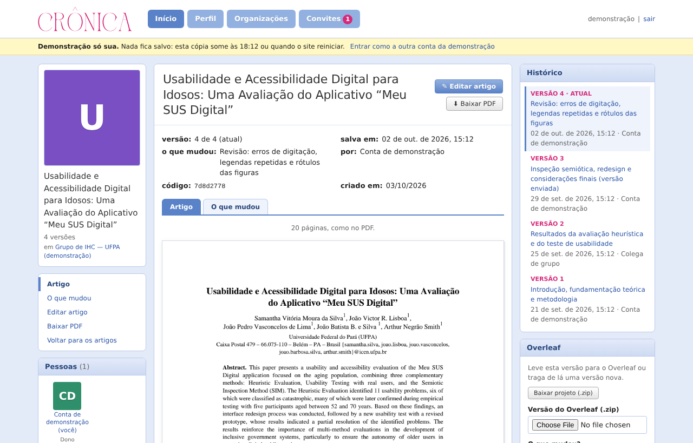
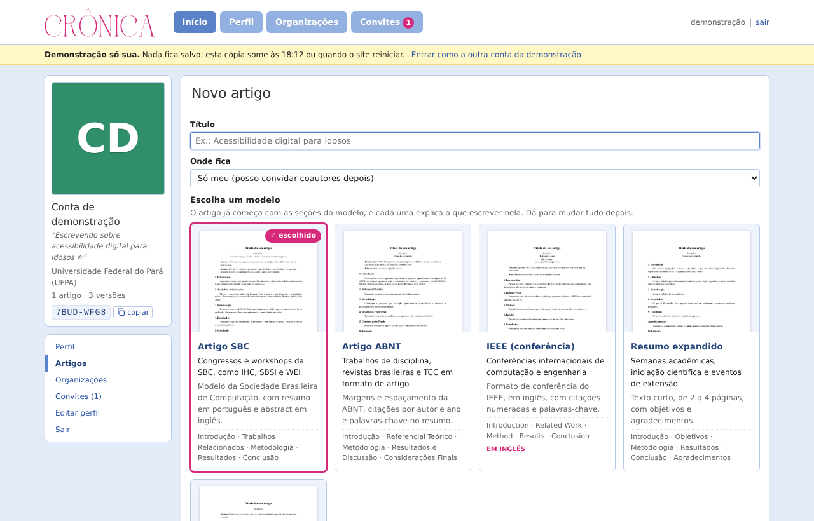
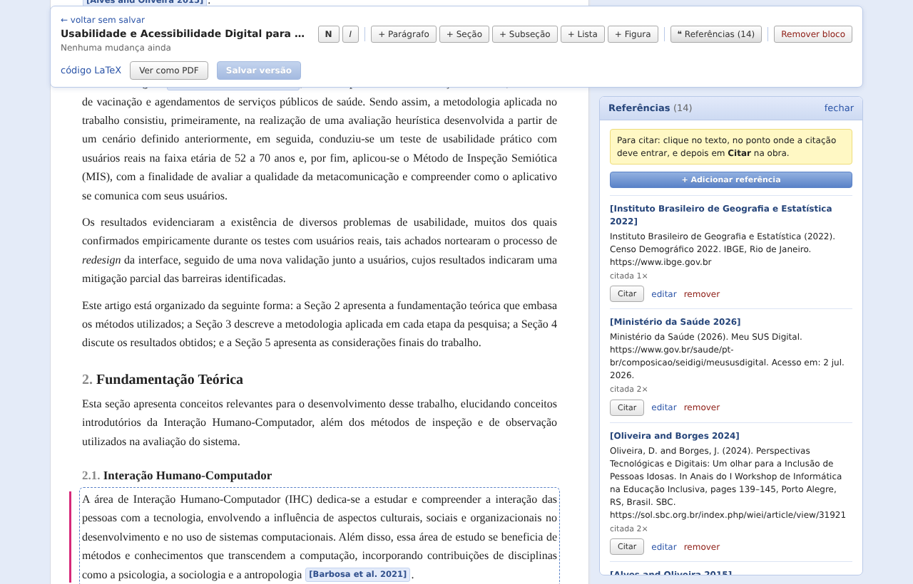
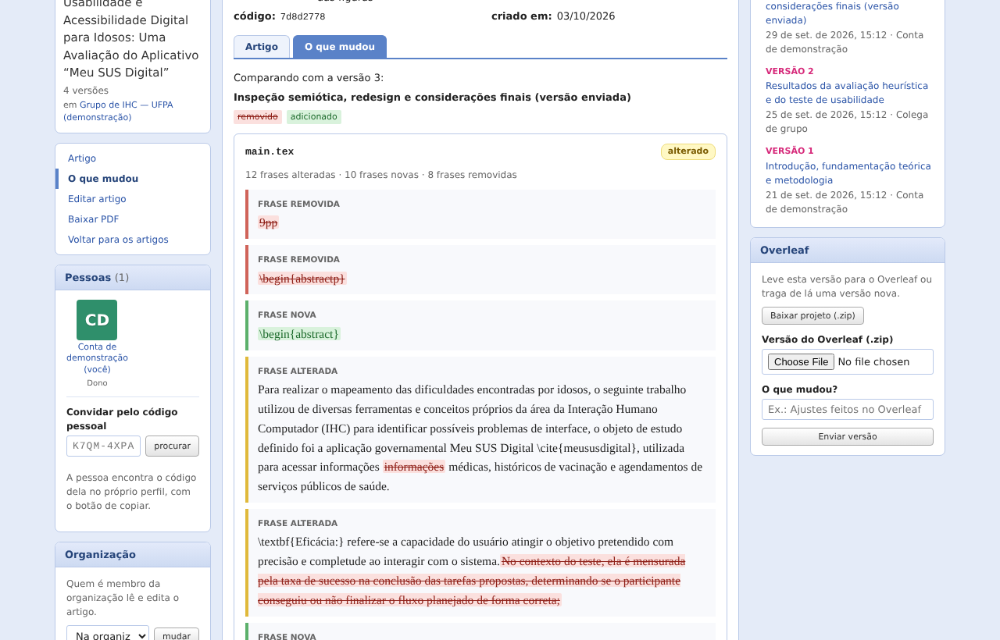
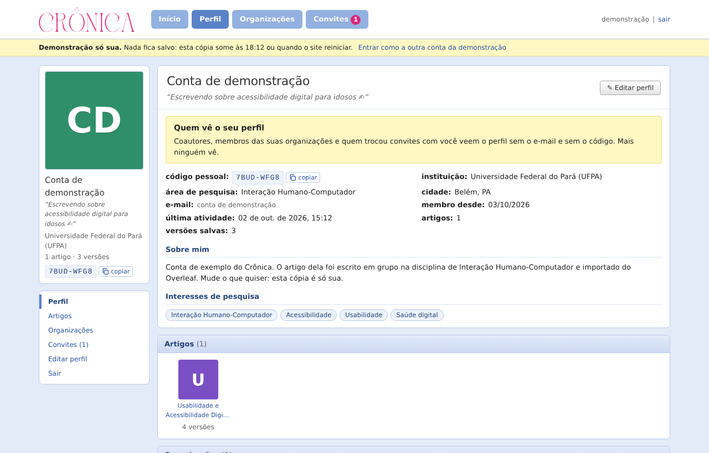
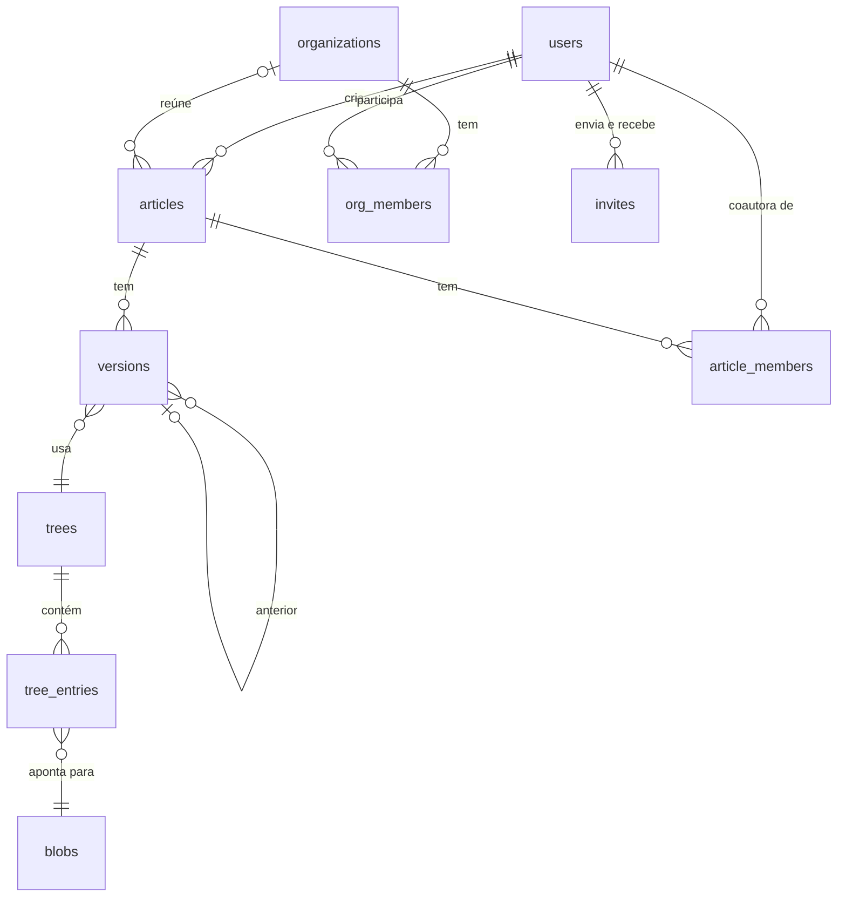

# Crônica

[](https://github.com/joaovictor-rl/cronica/actions/workflows/tests.yml)

Escreva o artigo no navegador, guarde cada versão e veja **frase a frase** o que mudou entre uma e outra. Pensado para pesquisadores que não programam: não precisa saber LaTeX nem Git. Quem usa o Overleaf pode importar o projeto e levá-lo de volta quando quiser.



O visual é inspirado nas redes sociais brasileiras dos anos 2000: abas azuis, caixas com cabeçalho, aviso em amarelo e uma coluna de perfil à esquerda.

## O que dá para fazer

- **Começar de um modelo**: Artigo SBC, Artigo ABNT, IEEE, Resumo expandido ou Em branco. Cada seção já vem com um texto explicando o que escrever nela.
- **Escrever no site**, num editor visual (parágrafos, seções, listas, negrito e itálico), ou no código LaTeX, para quem prefere.
- **Pôr figuras e referências.** As referências podem ser preenchidas num formulário, coladas do Google Acadêmico (BibTeX) ou buscadas pelo DOI. O botão "Citar" põe a citação no texto no estilo do formato: `[Silva 2020]` na SBC, `(SILVA, 2020)` na ABNT, `[1]` no IEEE.
- **Salvar versões** com uma frase dizendo o que mudou, e **ver o que mudou** palavra por palavra.
- **Ler e baixar o PDF** de qualquer versão. A leitura no site mostra as páginas do próprio PDF, e o editor mostra o PDF antes de salvar. O PDF segue as regras do formato: no modelo ABNT, margens, fonte, espaçamento, títulos, legendas e referências seguem as NBR 14724, 6022 e 6023; o IEEE sai em duas colunas.
- **Escrever em grupo.** Cada pessoa tem um código pessoal (como `K7QM-4XPA`). Com ele, quem criou o artigo convida coautores. **Organizações** reúnem um grupo de pesquisa: quem entra lê e edita os artigos dela.
- **Ter um perfil** com foto, frase, interesses, links (Lattes, ORCID, site) e a cor e o desenho do fundo, que aparecem para quem visita.
- **Usar o Overleaf**: importar o `.zip` do projeto, baixar qualquer versão como `.zip` ou enviar uma versão feita lá.

| Escolher o modelo | Editar com referências |
| --- | --- |
|  |  |
| **Ver o que mudou** | **Perfil** |
|  |  |

## Como rodar no seu computador

Precisa só do **Python 3.11 ou mais novo**. Na pasta do projeto:

```bash
python run.py
```

Na primeira vez o comando instala as dependências. Depois ele abre o navegador em http://localhost:8000. Para conhecer, clique em **"Entrar na demonstração"**: cada visitante ganha uma cópia só sua, com um artigo real em quatro versões, uma colega, uma organização e um convite. Nada do que é feito nela fica salvo.

Sem configuração, o banco é um arquivo SQLite (`backend/cronica.db`). A documentação interativa da API fica em http://localhost:8000/docs.

## Como hospedar

O site é um único programa Python: a mesma aplicação responde a API e entrega a interface. O jeito mais simples, sem pagar nada, é usar o **Render** para o site e o **Neon** para o banco de dados. O Neon é usado porque o banco gratuito do próprio Render é apagado depois de 30 dias.

1. **Banco (Neon).** Crie uma conta em [neon.com](https://neon.com) e um projeto. Copie o endereço de conexão ("connection string"), que começa com `postgresql://`.
2. **Site (Render).** Crie uma conta em [render.com](https://render.com) entrando com o GitHub. Escolha **New → Blueprint** e selecione este repositório. O Render lê o arquivo `render.yaml`, gera sozinho a chave `JWT_SECRET` e pede o `DATABASE_URL`: cole o endereço do Neon.
3. Pronto: o site fica em um endereço como `https://cronica.onrender.com`. A cada `git push`, o GitHub Actions roda os testes e o Render só publica a versão nova se todos passarem.

No plano gratuito do Render o site "dorme" depois de 15 minutos sem visitas e leva cerca de um minuto para acordar no primeiro acesso. As demonstrações abertas somem quando isso acontece; as contas e os artigos ficam guardados no Neon.

Em outro serviço, o que importa é: as variáveis `DATABASE_URL` (um PostgreSQL) e `JWT_SECRET` (uma senha longa e aleatória), a pasta `backend` como pasta do projeto, `pip install -r requirements.txt` para instalar e o comando de início que está no `render.yaml`. Quem preferir Docker pode usar o `Dockerfile` da raiz. O endereço `/health` responde `{"status": "ok"}` para a hospedagem saber que o site está no ar.

## Como o código está organizado

```
run.py                     roda tudo no seu computador com um comando
render.yaml                configuração da hospedagem no Render
examples/meu-sus-digital/  o artigo real usado na demonstração
backend/
  app/
    main.py                monta a aplicação: rotas, cabeçalhos de segurança e a interface
    config.py              o que vem de variáveis de ambiente (banco e chave dos logins)
    database.py            conexão com o banco e atualização de bancos antigos
    models.py              as tabelas
    schemas.py             o formato dos dados que entram e saem da API
    security.py            senhas, login (JWT) e limite de tentativas
    accounts.py            excluir conta e baixar os dados de alguém (LGPD)
    access.py              quem pode ver e editar cada artigo e organização
    versioning.py          como as versões são guardadas
    ingest.py              leitura segura do .zip do Overleaf
    invites.py             convites por código pessoal
    pictures.py            fotos e imagens de figuras
    demo.py                a demonstração descartável
    routers/               as rotas da API, uma por assunto
      auth.py              conta, login, perfil e demonstração
      articles.py          artigos, organização do artigo e coautores
      versions.py          histórico, comparação, PDF, salvar o que foi editado
      people.py            perfis, fotos e convites recebidos
      orgs.py              organizações
      templates.py         modelos de artigo
      references.py        ajuda para montar referências (formulário, BibTeX, DOI)
    document/              o artigo em LaTeX
      blocks.py, inline.py   LaTeX ⇄ blocos que o editor entende
      references.py          citações e lista de referências em cada estilo
      bibtex.py              escrever o arquivo .bib
      pdf.py                 gerar o PDF, com as regras de página de cada formato
      images.py              as imagens das páginas do PDF
      service.py             junta tudo: abrir uma versão, gerar o PDF
      templates.py           os modelos; os arquivos ficam em template_files/
    diff/                  a comparação entre versões (frases, palavras, referências)
    static/                a interface (HTML, CSS e JavaScript, sem framework)
      app.js               escolhe a página de cada endereço
      ui.js, widgets.js    peças usadas por várias páginas
      pages/               uma página por arquivo
      editor.js            o editor visual
      render.js            figuras, tabelas e a comparação em HTML
      api.js               conversa com a API
  tests/                   os testes automáticos
```

## Como funciona

### Do LaTeX para o editor e de volta

O `.tex` principal é transformado em blocos que o editor sabe mostrar: título, autores, resumo, seções, parágrafos, listas, figuras e tabelas. Dentro de cada parágrafo, comandos como `\cite`, `\ref` e fórmulas ficam preservados como etiquetas.

O cuidado principal é **não estragar o arquivo de quem escreveu**. Cada bloco guarda o trecho original. Ao salvar, um bloco que não foi editado é escrito exatamente como estava, e só os alterados são gerados de novo. Os testes garantem isso no artigo real: abrir e salvar sem editar devolve o arquivo byte a byte. O arquivo de referências segue a mesma regra.

### Versões

Cada arquivo é guardado uma única vez, identificado pelo SHA-256 do conteúdo. Uma versão aponta para uma lista de arquivos (a "árvore"). Ao editar um parágrafo, só o `main.tex` muda; figuras e referências são reaproveitadas. Por isso cada demonstração nova quase não ocupa espaço: as figuras já estão no banco.

Cada salvamento diz em qual versão se baseou. Se outra pessoa salvou antes, a resposta é `409` e nada é perdido. No PostgreSQL, a linha do artigo é travada durante o salvamento (`SELECT ... FOR UPDATE`), e um teste com dois salvamentos ao mesmo tempo garante que só um vence.

### Comparação que entende texto

O `.tex` é comparado por frase e, dentro da frase, por palavra, com cada comando LaTeX contado como uma unidade. Comentários e quebras de linha não contam como mudança. O `.bib` é comparado por referência e campo.

### Modelo de dados



## Segurança

- **Login:** senhas com bcrypt, sessão com JWT e limite de tentativas por endereço IP no login, no cadastro e na demonstração.
- **Acesso:** nenhum arquivo é servido pelo hash. O caminho é sempre artigo → versão → arquivo, passando por `access.py`, que decide o papel da pessoa (dono, coautor ou membro da organização). Artigos de outras pessoas respondem `404`, sem revelar que existem.
- **Privacidade (LGPD):** o cadastro pede concordância com a política de privacidade (página `#/privacidade`). Cada pessoa pode baixar os seus dados num `.zip` e excluir a conta; quem salvou versões em artigos de outras pessoas fica nelas como "Conta excluída". Outras pessoas nunca veem o e-mail, e perfis só abrem para quem escreve junto.
- **Arquivos enviados:** o `.zip` é tratado como hostil (caminhos com `..`, tamanho real dos arquivos, quantidade). Imagens são abertas com limite de pixels e salvas de novo, o que descarta metadados como a localização do celular.
- **Navegador:** a página só carrega scripts dela mesma (Content-Security-Policy) e não pode ser aberta dentro de outro site.

## Testes

```bash
cd backend
pip install -r requirements-dev.txt
pytest
```

São 109 testes: leitura e escrita do LaTeX no artigo real, comparação, modelos, formatação ABNT/SBC/IEEE, referências, API, permissões, convites, privacidade, demonstração e concorrência. Localmente rodam no SQLite. No GitHub Actions, a cada envio, rodam no PostgreSQL.

## Créditos

- O artigo da demonstração é de Samantha Vitória Moura da Silva, João Victor R. Lisboa, João Pedro Vasconcelos de Lima, João Batista B. e Silva e Arthur Negrão Smith (UFPA). O template SBC (`sbc-template.sty`, `sbc.bst`) é da Sociedade Brasileira de Computação.
- A logo usa a fonte Zaslia (suhadidesign), convertida em desenho vetorial. O ícone da aba é um livro aberto com uma pena.
